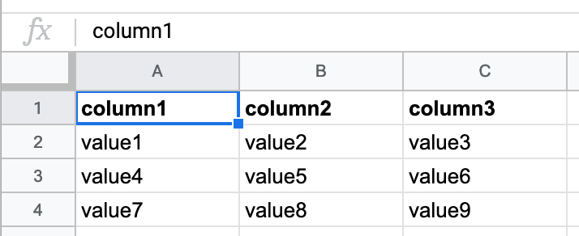
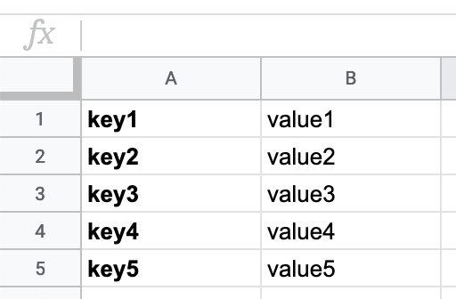

<h1 align="center">
  @newswire/sheet-to-data
</h1>
<p align="center">
  <a href="https://circleci.com/gh/rdmurphy/sheet-to-data"></a>
  <a href="https://www.npmjs.org/package/@newswire/sheet-to-data"></a>
  <a href="https://david-dm.org/rdmurphy/sheet-to-data"></a>
  <a href="https://packagephobia.now.sh/result?p=@newswire/sheet-to-data"></a>
</p>

`@newswire/sheet-to-data` is a simple wrapper around the [Google Sheets API](https://developers.google.com/sheets/api/) for converting the contents of a Google Sheet into a tabular or key-value data structure.

## Key features

- ⚙️ Produces structure data from a Google Sheet **without the use of an XLSX export** like [`node-copytext`](https://github.com/rdmurphy/node-copytext), resulting in more consistent and quicker output
- 🗄 All configuration lives **within the Google Sheet** instead of code, making it easier understand how data in a sheet is being processed at the source
- 👩‍🔧 Does not expect any particular method of authenticating with Google — **use the authenticated Google API instance, Google Sheets client or [authentication method](https://github.com/googleapis/google-api-nodejs-client#authentication-and-authorization) you are already using**

## Installation

`@newswire/sheet-to-data` requires a version of Node.js **8 or higher**. It is available via `npm`.

```sh
npm install --save-dev @newswire/sheet-to-data
# or
yarn add --dev @newswire/sheet-to-data
```

## Table of contents

<!-- START doctoc generated TOC please keep comment here to allow auto update -->
<!-- DON'T EDIT THIS SECTION, INSTEAD RE-RUN doctoc TO UPDATE -->

- [Structuring your spreadsheet](#structuring-your-spreadsheet)
  - [Tabular layout (`:table`)](#tabular-layout-table)
  - [Key-value layout (`:kv`)](#key-value-layout-kv)
  - [Skipped flag (`:skip`)](#skipped-flag-skip)
- [Usage](#usage)
- [Authentication](#authentication)
  - [1) Passing authentication](#1-passing-authentication)
  - [2) Passing an authenticated Google Sheets API client](#2-passing-an-authenticated-google-sheets-api-client)
  - [3) Passing an authenticated Google APIs instance](#3-passing-an-authenticated-google-apis-instance)
- [Contributing](#contributing)
- [License](#license)

<!-- END doctoc generated TOC please keep comment here to allow auto update -->

## Structuring your spreadsheet

All configuration for this library is done in the spreadsheet by adding a colon and a flag to the end of an individual sheet's title.

For example, if your sheet's title is `metadata` and you want it to be processed as a _key-value_ layout, you would change it to `metadata:kv`.


`@newswire/sheet-to-data` supports **three** flags that signify a sheet's layout — `:table`, `:kv` and `:skip`.

The title you give to a sheet is important because it will be assigned as the **key** for the processed output of the content of that sheet. (If a flag is present it will be stripped off the title before being assigned to.)

> **Why do configuration in the spreadsheet instead of the code?** This makes it possible for users who are primarily interacting with the spreadsheet to be able to encode the structure into data without being expected to write code. It also keeps the configuration as close to the source as possible.

### Tabular flag (`:table`)

> The _tabular_ layout is the **default** for all sheets without a flag and not necessary unless you want to be explicit.

The _tabular_ layout is arranged in **rows** and **columns**. After being processed by `@newswire/sheet-to-data`, each row in your sheet will become a JavaScript object and be put in an array of all the rows. Think of each row as if it is a line in a CSV - each value in the header row becomes the **key** for the **values** in each column.

So if you have a sheet that looks like this called `results` (or `results:table`):



It will become this:

```json
{
  "results": [
    {
      "column1": "value1",
      "column2": "value2",
      "column3": "value3"
    },
    {
      "column1": "value4",
      "column2": "value5",
      "column3": "value6"
    },
    {
      "column1": "value7",
      "column2": "value8",
      "column3": "value9"
    }
  ]
}
```

### Key-value flag (`:kv`)

The _key-value_ layout only uses the **first two columns** of a sheet, and there's no concept of a "header row." (Feel free to use the rest of the columns for additional context or notes, the library will ignore them.) In each row of the sheet, the contents of cells in _column A_ represent the **key** for each **value** in _column B_, creating a single JavaScript object representing each `key -> value` pair.

So a sheet like this called `metadata:kv`:



Will become this:

```json
{
  "metadata": {
    "key1": "value1",
    "key2": "value2",
    "key3": "value3",
    "key4": "value4",
    "key5": "value5"
  }
}
```

### Skip flag (`:skip`)

A sheet flagged with `:skip` is a signal to `@newswire/sheet-to-data` that it should **ignore** this sheet entirely and not attempt to process it.

The library will also ignore any sheets that have been **hidden** using the Google Sheet interface.

## Usage

`@newswire/sheet-to-data` exports a single function - `sheetToData`.

```js
const { sheetToData } = require('@newswire/sheet-to-data');
const { google } = require('googleapis');

async function main() {
  // this method looks for the GCLOUD_PROJECT and GOOGLE_APPLICATION_CREDENTIALS
  // environment variables to establish authentication
  const auth = await google.auth.getClient({
    scopes: ['https://www.googleapis.com/auth/spreadsheets.readonly'],
  });

  // pass in the valid authentication and ID of the sheet you want to process
  const results = await sheetToData({ spreadsheetId: '...', auth });

  console.log(results); // `results` is your JavaScript object representing the processed data in the spreadsheet
}

main().catch(console.error);
```

## Authentication

`sheetToData` has one required parameter — `spreadsheetId`. But the authentication you provide with the Google API may be handled in one of the three ways detailed below.

_Acquiring_ this authentication is beyond the scope of this project's documentation, but two good starting points are [Google's official Node.js quickstart guide for the Google Sheets API](https://developers.google.com/sheets/api/quickstart/nodejs) and the [client library's authentication documentation](https://github.com/googleapis/google-api-nodejs-client#authentication-and-authorization).

### 1) Passing authentication

`sheetToData` doesn't limit authentication to only OAuth2 (although it certainly supports it!) and will accept any authenticated client that the Google Sheets API supports.

After establishing authentication [using one of the methods](https://github.com/googleapis/google-api-nodejs-client#authentication-and-authorization) supported by `googleapis`, you can pass this auth directly to `sheetToData` and it'll handle the rest.

```js
const { sheetToData } = require('@newswire/sheet-to-data');
const { google } = require('googleapis');

async function main() {
  // this method looks for the GCLOUD_PROJECT and GOOGLE_APPLICATION_CREDENTIALS
  // environment variables to establish authentication
  const auth = await google.auth.getClient({
    scopes: ['https://www.googleapis.com/auth/spreadsheets.readonly'],
  });

  // pass in the valid authentication, which is used to create a Google Sheets API client internally
  const results = await sheetToData({ spreadsheetId: '...', auth });
}

main().catch(console.error);
```

> (This example uses the [service-to-service authentication](https://github.com/googleapis/google-api-nodejs-client#service-to-service-authentication) method.)

### 2) Passing an authenticated Google Sheets API client

Maybe you've been working with the Google Sheets API and have already set up an authenticated instance of the Google Sheets API client that has access to the sheets you'd like to work with. `sheetToData` will accept that and use it!

```js
const { sheetToData } = require('@newswire/sheet-to-data');
const { google } = require('googleapis');

async function main() {
  // this method looks for the GCLOUD_PROJECT and GOOGLE_APPLICATION_CREDENTIALS
  // environment variables to establish authentication
  const auth = await google.auth.getClient({
    scopes: ['https://www.googleapis.com/auth/spreadsheets.readonly'],
  });

  // create your own Google Sheets API client
  const client = google.sheets({
    version: 'v4',
    auth,
  });

  // pass in the authenticated Google Sheets API client
  const results = await sheetToData({ spreadsheetId: '...', client });
}

main().catch(console.error);
```

> (This example uses the [service-to-service authentication](https://github.com/googleapis/google-api-nodejs-client#service-to-service-authentication) method.)

### 3) Passing an authenticated Google APIs instance

Maybe you've been using multiple Google API services and have [set authentication across all Google APIs globally](https://github.com/googleapis/google-api-nodejs-client#setting-global-or-service-level-auth). `sheetToData` can accept the authenticated `googleApisInstance` and use that to create the Google Sheets API client - no passing of `auth` necessary.

```js
const { sheetToData } = require('@newswire/sheet-to-data');
const { google } = require('googleapis');

async function main() {
  // this method looks for the GCLOUD_PROJECT and GOOGLE_APPLICATION_CREDENTIALS
  // environment variables to establish authentication
  const auth = await google.auth.getClient({
    scopes: ['https://www.googleapis.com/auth/spreadsheets.readonly'],
  });

  // set auth as a global default
  google.options({ auth });

  // pass in the GoogleApisInstance, which will be used to connect to the Google Sheets API
  const results = await sheetToData({ spreadsheetId: '...', google });
}

main().catch(console.error);
```

> (This example uses the [service-to-service authentication](https://github.com/googleapis/google-api-nodejs-client#service-to-service-authentication) method.)

## Contributing

First clone the repo to your local device and install the dependencies.

```sh
yarn
```

After making any changes, you'll need to run the tests. But this is a little tricky because we perform an integration test against a live Google Sheet file. To make the tests work for you locally, you'll need to do a few extra steps.

First make a copy of the test spreadsheet file:

[Click here to make a copy of the test spreadsheet file](https://docs.google.com/spreadsheets/d/13gffPNK63xOhqrr8sX51Dth8fYOq9s8xFS4WbWfueHo/copy)

Once you have the file, you'll need to get its ID and set the correct environment variables so the test runner finds them. To get the ID **look at the URL of the file** in your browser - it is the long string of random characters and numbers near the end.

https://<span></span>docs.google.com/spreadsheets/d/**13gffPNK63xOhqrr8sX51Dth8fYOq9s8xFS4WbWfueHo**/edit

Set the following environmental variables in your shell:

```sh
export SPREADSHEET_ID=<sheet_id>
```

Next you'll need to create a service account (or use an existing one) and give it access to your copy of the spreadsheet. Typically this is done by sharing those files with the email of the service account in the spreadsheet sharing interface.

Finally, we need to tell the test runner how to use the service account authentication to communicate with the API. The best method for doing this is the [service-to-service authentication method](https://github.com/googleapis/google-api-nodejs-client#service-to-service-authentication). Typically this means setting the `GOOGLE_APPLICATION_CREDENTIALS` environmental variable and pointing it at the location of your service account authentication JSON file.

```sh
export GOOGLE_APPLICATION_CREDENTIALS=<path_to_json_file>
```

And... now you're ready to go! You should be able to run the tests.

```sh
yarn test
```

If anyone has any suggestions on how to make this a smoother process, please let me know!

## License

MIT
